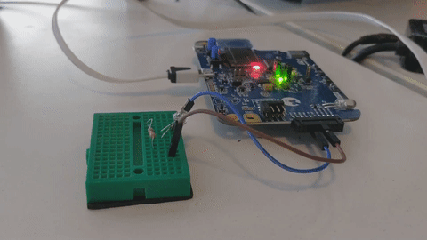
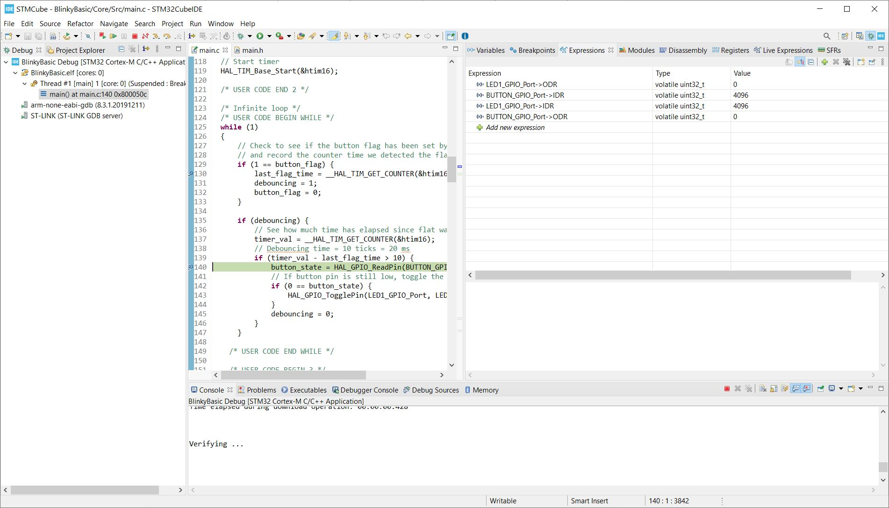

# Assignment 4: Blinky is as Blinky Does
On your final project board, make blinky for yourself. Then add a button to turn the LED on and off. Bonus points for making the button cause an interrupt. Triple bonus points for debouncing the button signal.

What are the hardware registers that cause the LED to turn on and off? (From the processor manual, don’t worry about initialization.) What are the button registers that you read? Can you read that memory directly and see the button change in a debugger or by printing out the associated memory?



## Code
I did this project in stages. First simply making the LED blink, then toggling the LED inside an interrupt function triggered by a push button, and finally adding debouncing. Most of my time was spent learning the workings of the STM32Cube IDE.

The ST32WBMMG-DK board has no built-in LED, so I added a standard LED and current limiting resistor to GPIO pin 11, and configured pin 11 as a GPIO output. 

The ST32WBMMG-DK has two user push buttons, on pins PB12 and PB13. I selected Pin 12, configured as a GPIO input with a pull-up resistor to trigger an interrupt on falling edge detection.

The final, debounced code configuration is entirely in **main.c** (included in this repository). To allow debouncing, the LED pin state is toggled in _main(void)_ in response to a global flag, _button_flag_, defined as shown:
```C
/* USER CODE BEGIN PV */

// Global flag with value set by the button interrupt calback function
static volatile int8_t button_flag = 0;

/* USER CODE END PV */
```
The value of _button_flag_ is set when the interrupt processing function, _**EXTI15_10_IRQHandler**(void)_, calls a callback function, _**HAL_GPIO_EXTI_Callback(uint16_t GPIO_Pin)**_. Since _**HAL_GPIO_EXTI_Callback**_ is initially defined with the \__weak_ keyword, it can be overridden with a new definition in **main.c**:
```C
/* USER CODE BEGIN 4 */
// Override the callback function which is called by the intterupt
// processing function. If the interrupt came from our button pin,
// set the flag to 1
void HAL_GPIO_EXTI_Callback(uint16_t GPIO_Pin) {
	if (GPIO_Pin == BUTTON_Pin) {
		button_flag = 1;
	}
}
/* USER CODE END 4 */

```

I didn’t come up with this solution by myself. It took a fair amount of Googling to figure out how to use interrupts to set a flag variable, but I now have a much better understanding of the sequence of functions called  when a GPIO interrupt is processed.

Timer TIM16 is configured to track time for the debouncing process. It is a 16 bit timer not used for any other process. I’m still a bit confused by the prescaler settings, but I followed the directions in a DigiKey (Shawn Hymel) video on STM32Cube coding to try to figure it all out. From the Clock Configuration tab in STM32Cube, it appears the default clock speed is 4 MHz. I set the prescaler to 8000, for a clock frequency of 500 Hz or a clock rate of 2 ms/tick. I debounced over a period of 10 ticks = 20 ms, which may be short, but seems to work fine in practice. The relevant debouncing code from _main()_ is shown below:

```C
 /* USER CODE BEGIN 1 */

  // Track whether we are debouncing
  static uint8_t		debouncing = 0;

  // Record the time the button was pushed
  static int16_t 		last_flag_time;

  // Local variables
  uint16_t 				timer_val;
  GPIO_PinState 		button_state;


  // UART output helpful for debugging
  //char uart_buf[50];
  //int uart_buf_len;

  /* USER CODE END 1 */
```
.
.
.

```C
 /* Infinite loop */
  /* USER CODE BEGIN WHILE */
  while (1)
  {
	  // Check to see if the button flag has been set by the interrupt callback,
	  // and record the counter time we detected the flag.
	  if (1 == button_flag) {
		  last_flag_time = __HAL_TIM_GET_COUNTER(&htim16);
		  debouncing = 1;
		  button_flag = 0;
	  }

	  if (debouncing) {
		  // See how much time has elapsed since flat was set
		  timer_val = __HAL_TIM_GET_COUNTER(&htim16);
		  // Debouncing time = 10 ticks = 20 ms
		  if (timer_val - last_flag_time > 10) {
			  button_state = HAL_GPIO_ReadPin(BUTTON_GPIO_Port, BUTTON_Pin);
			  // If button pin is still low, toggle the LED
			  if (0 == button_state) {
				  HAL_GPIO_TogglePin(LED1_GPIO_Port, LED1_Pin);
			  }
			  debouncing = 0;
		  }
	  }

    /* USER CODE END WHILE */
```
## Register Values
As stated, the LED and push button are connected to GPIO pins 11 and 12 respectively. From the user manual, each the GPIO pin has two 32-bit data registers, GPIOx_IDR and GPIOx_ODR. So, if we can find the register addresses of GPIO11_ODR and GPIO12_IDR we should be able to observe the data changing for the LED and Push button directly. I was able to use the STM32Cube "Expression" Window to track the values of BUTTON_GPIO_PORT->IDR/ODR, and LED1_GPIO_PORT->IDR/ODR. Tracking the state of the 11th and 12th bit of these 32 bit integers should give the state of the LED & Push Button data in the register.


